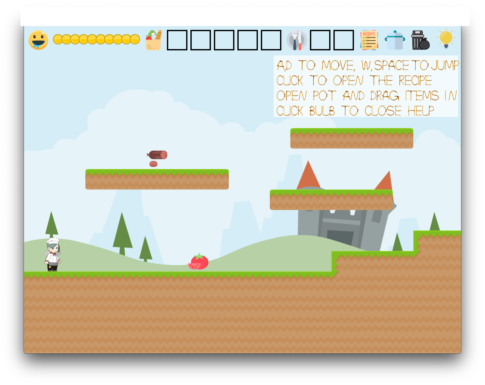

# (TODO: your game's title)

Author: (TODO: your name)

Design: (TODO: In two sentences or fewer, describe what is new and interesting about your game.)

Screen Shot:

How To Play:

(TODO: describe the controls and (if needed) goals/strategy.)

Sources:

(TODO: fill in information about the sources of any **artwork** or **sounds** you used in the game that you did not create yourself. Feel free to also credit yourself for things you did make.)

This game was built with [NEST](NEST.md).
