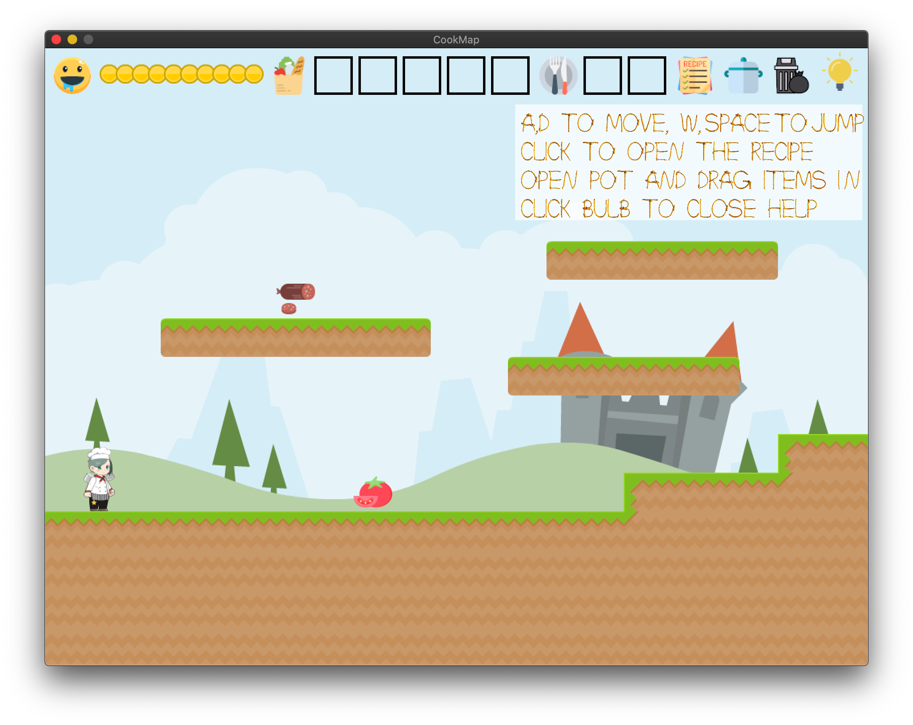

# CookMap

Author: Xuyang Fang, Zihao He, Junjie Wang, Haomin Wang

Design: This is a 2D adventure game where palyer has to collect ingredients, try out different recipes and find the ultimate delicacy.

Screen Shot:

How To Play: Press A/D to move left/right. Press SPACE to jump. Click "Cook" with mouse to make some dish. Drag your cooked dish to the Guard to bribe him and pass.

Sources:

The rope font comes from https://sourceforge.net/projects/rods-custom-font-xcf-files/ .

The assests mainly come from GIMP-2.10, Kenny.nl (https://www.kenney.nl), Flaticon (www.flaticon.com).

Garbage icon made by Payungkead from www.flaticon.com.
Wheat/Pepper/Bonfire icons made by Freepik from www.flaticon.com.
Salami/Pizza/Bulb/Star icons made by Smashicons from www.flaticon.com.
The components of chef are 2d assets we bought from unity asset store.

This game was built with [NEST](NEST.md).
