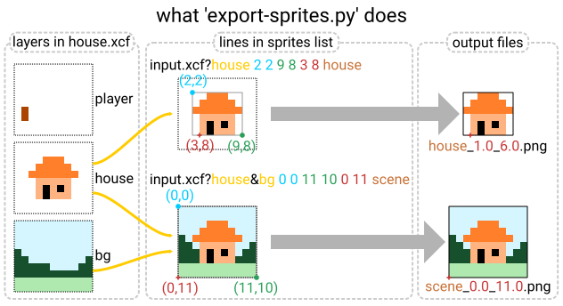

# 15-466 Sprite Pipeline

Sprites are pixel rectangles. Our sprite pipeline deals with them by packing them into atlas textures. The pipeline works in two steps: first, sprites are **extracted** from source images, then they are **merged** into atlases.

## Extraction

Sprite extraction is done by `extract-sprites.py`:

```
python3 extract-sprites.py <sprites.list> <out_directory> [--gimp=path/to/gimp]
```

Where `sprites.list` has lines in the following format:
```
"image-to-load.xcf?layer 1&layer 2&layer 3" minX minY maxX maxY anchorX anchorY "output name"
```

The script uses GIMP to crop the image to the `[minX,maxX)x[minY,maxY)` rectangle (in pixels, with the origin in the upper left), and writes an output file `out_directory/output name_ax_ay.png` where ax and ay are anchor values (in pixels, with the origin in the upper left).

Note that if maxX, maxY, anchorX, or anchorY starts with `+` it is interpreted relative to minX/minY. This means you can copy values directly from the rectangle select dialog in GIMP.



If layer names are given, only these layers will be shown. If no layer names are given, layer visibility will remain whatever the default is in the file.

## Packing

Sprite packing is done by `pack-sprites`, compiled from `../pack-sprites.cpp`:

```
./pack-sprites outfile in-directory/*.png
```

The program uses a first-fit, largest-first heuristic to pack the sprites into a rectangular (power-of-two-sized) texture, which it saves to `outfile.png`; it also writes the sprite atlas location information to `outfile.atlas`.

## Name Encoding

The files that `extract-sprites.py` writes and `pack-sprites` store the sprite name in the filename. This means that there must be some encoding mechanism in place to avoid problems on case-sensitive or utf-intolerant filesystems. The encoding used is the following "underscore encoding":

 - any numbers, dashes, or lowercase letters (i.e., `[a-z0-9-]`) encode as themselves
 - `_` encodes to `__`
 - `_A` encodes to `_a` (and other capital letters similarly)
 - anything else encodes as `_0HH`, `_0HHHH`, `_0HHHHHH`, or `_0HHHHHHHH` (where the `H...H` string is the UTF-8 encoding of the character)


## Windows Note

Windows (and, to be fair, the windows port of GIMP) is broken in a number of ways which make productive command-line use discouragingly difficult. Despite this, I have included a `make-sprites-win.py` to work around these issues and allow you to run the sprite processing pipeline on Windows. You will likely need to edit the file to get the path to `gimp-console.exe` set properly.

I am assured that powershell works around all of these limitations.
